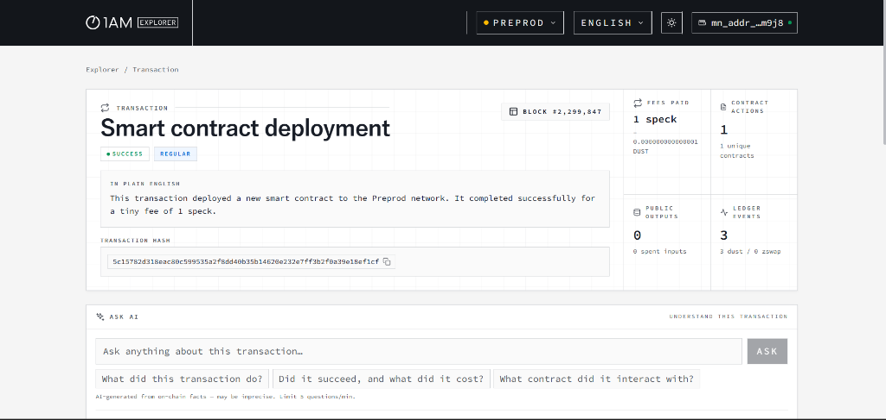
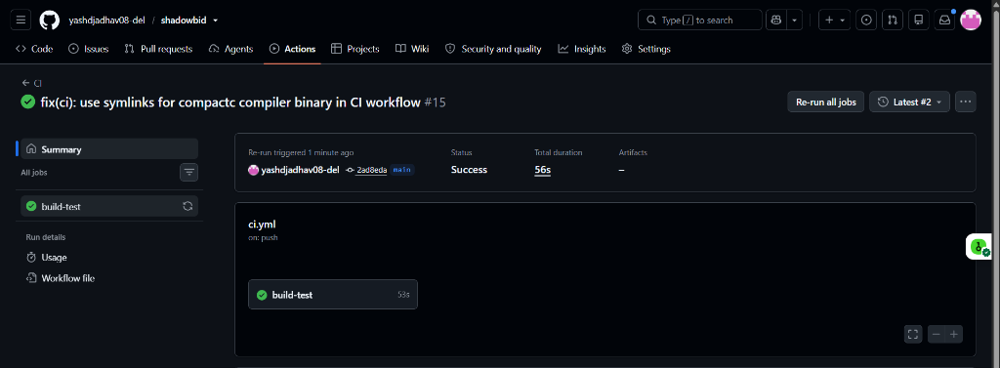
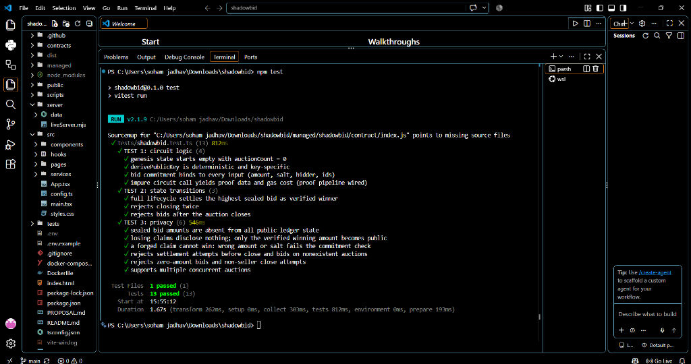

# ShadowBid

[](https://github.com/yashdjadhav08-del/shadowbid/actions/workflows/ci.yml)
[](https://shadowbid-lilac.vercel.app)
[](https://vercel.com/new/clone?repository-url=https://github.com/yashdjadhav08-del/shadowbid)

> Privacy-preserving sealed-bid auction built with Midnight.

## Live Demo & Deployment

- 🚀 **Live App**: [https://shadowbid-lilac.vercel.app](https://shadowbid-lilac.vercel.app)
- ⚡ **1-Click Deploy**:

[](https://vercel.com/new/clone?repository-url=https://github.com/yashdjadhav08-del/shadowbid)

Click the **Deploy with Vercel** button above to deploy your own instance of ShadowBid to Vercel in 1 click.

> **Note**: To interact with the live demo, make sure you have the [1AM Wallet extension](https://midnight.network) installed and set to **Preprod** network with tDUST from the faucet.

## Running Locally (shared multi-user live sync)

All users see the same active auctions because the app discovers ONE shared
contract on Midnight's public network and streams updates through a small live
server. Run it exactly like this — the live server is REQUIRED, not optional:

```sh
npm install --force
npm run sync-assets          # copies managed/ ZK artifacts if needed
npm run server               # live server: SPA + /api + SSE on http://localhost:5176
# in another terminal (only if developing):
npm run dev                  # optional Vite dev server on :5173 (proxies /api -> :5176)
```

Then open **http://localhost:5176** in the browser. For production, `npm run
build` outputs to `dist/` and `npm run server` serves it directly — no Vite
needed.

Multi-user flow:

1. **User A** opens the app, connects 1AM, and creates an auction. The first
   create deploys the contract; the app publishes the contract address to the
   live server (`POST /api/contract`).
2. **User B** (different browser/machine) opens the same URL, connects their
   own wallet. The app has no locally stored address, so it falls back to the
   live server (`GET /api/contract`), finds User A's contract, and reads the
   same on-chain auctions through the indexer. B never deploys an isolated
   second contract.
3. New auctions appear live for everyone via Server-Sent Events
   (`/api/live-stream`).

Only public data crosses the network (item name/description, bid counts,
contract address, winner after close). Bid amounts and salts never leave the
browser — they are private circuit witnesses, so they never appear in the API,
on the server, or in any shared state.

## Contract Address & On-Chain Verification

| Network | Status | Transaction / Block |
|---------|--------|---------------------|
| Preprod | `SUCCESS` | Tx: `5c15782d318eac80c599535a2f8dd40b35b14620e232e7ff3b2f0a39e18ef1cf` · Block `#2,299,847` |



The contract is deployed directly on Midnight's Preprod network via the 1AM Wallet; all subsequent user interactions bind securely to this on-chain instance.

## What This Does

ShadowBid is a **sealed-bid auction** where bid amounts are genuinely private:

- A **seller** creates an auction for an item (e.g. "MacBook Pro").
- **Bidders** submit sealed bids — e.g. Alice → 500, Bob → 750, Charlie → 600.
- **No one** can see any individual amount on-chain: not other bidders, not
  the seller, not an indexer, and not the UI.
- After close, the winner is derived by Midnight circuits verifying real
  sealed-bid claims in zero knowledge — the winner is **not hardcoded**, not
  faked, and losing amounts are never revealed.

The public ledger only ever holds hiding commitments; individual values exist
exclusively as private circuit witnesses inside zero-knowledge proofs.

## How It Works

```
Seller            Bidders                Midnight                    Result
──────            ───────                ────────                    ──────
Create Auction ─→ open, public metadata
                  Private Bid ─────────→ submitBid circuit:
                                          amount = private witness,
                                          ledger stores only
                                          H(amount‖salt‖key‖context)
                                        proof per bid (ZK)
Close Auction ←── seller-only ZK check   bidding sealed
                                        claimWin circuit:
                                          proves commitment preimage
                                          without revealing amount;
                                          updates winner only if the
                                          private amount beats best
                                        ──────────────────────────→ 🏆 Verified Winner
                                                                 (winning amount disclosed;
                                                                  losing bids stay sealed)
```

1. **Seller** connects the 1AM wallet and calls `createAuction` — item name and
   description are public metadata; a pseudonymous seller commitment
   (`H("shadowbid:key:v1" ‖ secret)`) is stored for authorization.
2. **Bidders** connect and submit **private bids** via `submitBid`. The amount
   is a private circuit input; the circuit hashes it with a fresh random salt
   into a domain-separated commitment stored in a public map. Only the *count*
   of bids becomes visible.
3. Every call runs as a **Midnight circuit + zero-knowledge proof**: the logic
   executes locally, is proven, and the network verifies the proof instead of
   re-executing anything.
4. The seller closes the auction (`closeAuction`) — allowed only when the
   caller's derived key matches the stored seller commitment, enforced in-circuit.
5. **Winner verification**: each genuine bidder may call `claimWin`, proving in
   ZK that they know the preimage of a sealed commitment. The circuit updates
   the verified winner only if the private amount strictly beats the current
   public best. Forging requires breaking the hash preimage — the outcome is
   derived from actual sealed data, never hardcoded.
6. **Selective disclosure**: at settlement exactly one amount — the winning
   price — crosses into public state. Losing amounts are provably absent from
   the ledger (see tests).

## Privacy Model

### PUBLIC

| Data | Where |
|------|-------|
| Auction id, item name & description | ledger maps |
| Status (`OPEN` / `CLOSED`), sealed-bid **count** | ledger struct |
| Bid commitments (hiding hashes) | `bidCommitments` map |
| Pseudonymous seller / winner commitments | ledger struct |
| Final winning amount (intentional disclosure) | ledger struct |

### PRIVATE

| Data | Where |
|------|-------|
| Individual bid amounts | private circuit witness |
| Bid salts | generated client-side, local only |
| Per-user pseudonym secret keys | wallet-scoped local store / private state |

### PROVED WITHOUT REVEALING

- That a claimed `(auctionId, index, key, salt, amount)` tuple hashes to a
  commitment actually present in the ledger.
- That a claim beats the current public best before the winner updates.
- That the closer of an auction knows the seller secret (hash equality).
- All of the above are enforced by Compact circuits compiled to ZK proofs —
  verification happens on-chain without learning the inputs.

## Privacy Claim

An **on-chain observer** (indexer, explorer, chain analysis) can learn:

- when auctions are created/closed, their public metadata, and how many sealed
  bids each has;
- every bid commitment (a hash — irreversible without the salt);
- after settlement, the winning amount and the winner's pseudonymous commitment;
- that a given claim attempt did or didn't update the current best (an inherent
  consequence of public settlement), which upper-bounds losing amounts by the
  winning price.

They **cannot** learn any losing bidder's amount, any salt, or link a
pseudonymous commitment to a wallet beyond what transaction metadata already
shows. These claims are backed by `tests/shadowbid.test.ts` (TEST 3), which
asserts sealed amounts are absent from all decoded public state — numerically
and byte-wise.

Privacy is enforced by the contract and the proof system, **not** by the
frontend. Hiding values in React would be irrelevant: the ledger itself has
nothing to hide.

## 1AM Wallet

ShadowBid integrates the **1AM wallet** through the official DApp Connector API
(CAIP-372, `@midnight-ntwrk/dapp-connector-api@4.x`):

- wallet discovery via `window.midnight` enumeration (1AM preferred),
- `connect(networkId)` authorization, disconnect, connection-status checks,
- display of the connected account,
- transaction authorization popups for every circuit call,
- proving delegated to the wallet via its `getProvingProvider` (with automatic
  fallback to a local proof server for wallets without built-in proving),
- explicit handling of rejected, failed, and in-flight transactions with clear
  progress states ("Generating privacy proof… please wait").

Seed phrases and private keys are never requested, displayed, or stored by this
application. Each user additionally gets an app-level pseudonym key (random
32 bytes, kept in the browser) used by the contract's witness — separate from
all wallet keys.

## Zero-Knowledge / Midnight Privacy

- **Compact contract** (`contracts/shadowbid.compact`) compiled with the
  official toolchain (`compact compile`, compiler 0.31.x) to four impure
  circuits plus two pure helpers.
- **Private inputs / witnesses**: bid amounts and salts enter circuits as
  private parameters/witnesses; the caller's key comes from private state.
- **Circuits enforce everything**: existence checks, status guards, seller
  authorization, commitment recomputation, winner comparison.
- **Proof generation & verification**: each call produces a ZK proof via the
  wallet prover or local proof server; the network verifies keys bound at
  deploy time.
- **Public/private separation**: `disclose()` is used deliberately — the
  compiler statically rejects undeclared leaks (it caught two during
  development) and forces disclosure declarations at branch boundaries.
- **Selective disclosure**: only the winning amount ever crosses into public
  state, and only when strictly beating the previous best.

## Tech Stack

- **Midnight** — privacy blockchain; Compact smart-contract language; ZK proofs
- `compactc` 0.31.x compiler · `@midnight-ntwrk/compact-runtime@0.16`
- `@midnight-ntwrk/midnight-js-*` 4.1.x (deploy/find/call, providers)
- `@midnight-ntwrk/dapp-connector-api@4.x` (1AM wallet)
- `midnightntwrk/proof-server:8.1` (Docker)
- React 18 + TypeScript + Vite, Vitest, Docker, GitHub Actions

## Prerequisites

- Node.js ≥ 22
- npm ≥ 10
- Docker (proof server / containerized run)
- The [Compact toolchain](https://github.com/midnightntwrk/compact):
  ```bash
  curl --proto '=https' --tlsv1.2 -LsSf https://github.com/midnightntwrk/compact/releases/latest/download/compact-installer.sh | sh
  ```
- A Midnight wallet extension (**1AM**) in your browser, funded on the target
  network (Preprod tNIGHT via the faucet)

## Setup & Run Locally

```bash
# 1. Install dependencies
npm install

# 2. Compile the Compact contract -> managed/shadowbid
npm run compile-contract

# 3. Copy ZK artifacts into public/ (done automatically by predev/prebuild)
npm run sync-assets

# 4. Configure (optional) — defaults to preprod
cp .env.example .env

# 5. Start the dev server
npm run dev
# open http://localhost:5173

# 6. Connect the 1AM wallet, then:
#    - Create Auction (first create deploys the contract if none joined yet)
#    - Open the auction in another browser profile to bid privately
#    - Close (as seller), then settle from "My Participation"
```

Contract deployment/calls need DUST for fees; register your funded wallet for
DUST generation as described in the Midnight docs ("Funding a wallet").

## Vercel Deployment

ShadowBid is fully configured for continuous deployment on [Vercel](https://vercel.com):

1. Push this repository to GitHub.
2. Go to [Vercel Dashboard](https://vercel.com/new) and click **"Add New Project"**.
3. Import your GitHub repository (`shadowbid`).
4. Framework Preset: **Vite** (automatically detected from `vercel.json`).
5. (Optional) Set environment variables in Vercel project settings:
   - `VITE_MIDNIGHT_NETWORK_ID`: `preprod` (default)
6. Click **Deploy**. Vercel will automatically build the application and serve ZK keys, WASM modules, and serverless sync API endpoints.

## Docker

```bash
# Build + run dApp and a local proof server
docker compose up --build
# dApp:      http://localhost:8080
# Proof srv: http://localhost:6300
```

The image multi-stage builds: installs the Compact toolchain → compiles the
contract → runs the test suite → builds the frontend → serves `dist/` together
with the ZK artifacts over nginx.

## Continuous Integration & Verification

The project includes automated CI pipelines on GitHub Actions verifying compilation, asset syncing, and test suites across all commits:



## Run Tests

```bash
npm test
```



13 tests pass against the compiled contract logic via
`@midnight-ntwrk/compact-runtime` (no node/infra required):

| # | Test | Verifies |
|---|------|----------|
| TEST 1 | Circuit logic | genesis state, deterministic key derivation, commitment binding to every input, proof-data pipeline |
| TEST 2 | State transitions | full lifecycle create → bid×3 → close → claims → settled winner; double-close, late-bid, non-seller-close rejections |
| TEST 3 | Privacy | sealed amounts absent from ALL public state (numeric + LE/BE byte scan); losing amounts vanish after outbid; forged claims (wrong amount/salt/index) rejected; claims before close rejected; zero-amount bids rejected; concurrent auctions isolated |
